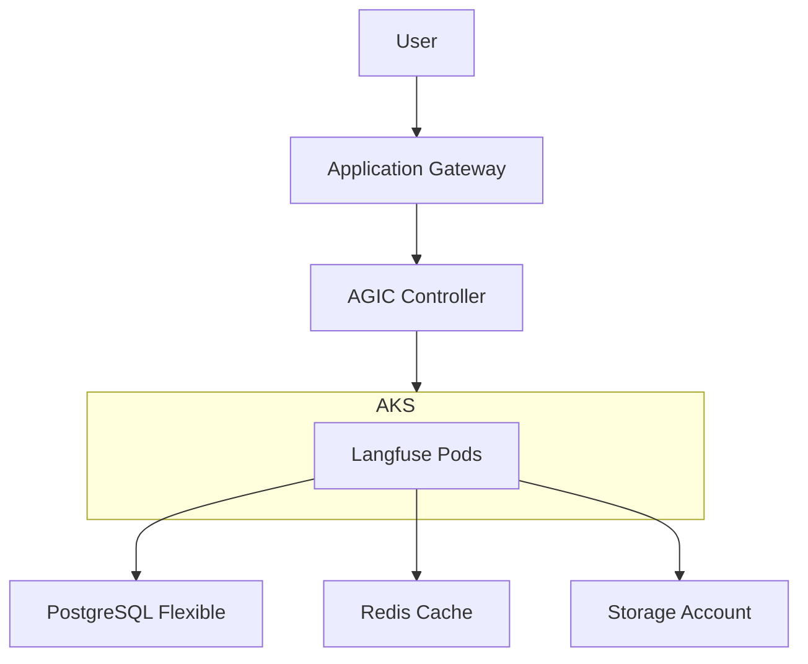

# Azure Container Apps 版 Langfuse: アーキテクチャとコスト比較

このドキュメントでは、**Upstream Repository (AKS)** のアーキテクチャと、本リポジトリで実装されている **Container Apps (ACA)** アーキテクチャの包括的な比較を行います。コスト分析、アーキテクチャの変更点、および主要な技術的決定事項について説明します。

> [!NOTE]
> **比較対象について**
>
> - **Upstream Repository**: [langfuse/langfuse-terraform-azure](https://github.com/langfuse/langfuse-terraform-azure) (オリジナルの AKS ベース構成)
> - **本リポジトリ**: Azure Container Apps (ACA) ベースの実装

---

## 1. エグゼクティブサマリー

**なぜ Container Apps なのか？**
AKS から Container Apps に切り替えることで、実用最小限の本番環境セットアップにおいて **約 15% のコスト削減** が見込めますが、それ以上に重要なのは **運用上の複雑さが大幅に軽減される** 点です。

| 機能 | Upstream (AKS) | 本リポジトリ (ACA) |
| :--- | :--- | :--- |
| **コンピューティング基盤** | Azure Kubernetes Service (AKS) | Azure Container Apps |
| **管理オーバーヘッド** | 高 (K8s アップグレード、ノード管理) | 低 (サーバーレス / フルマネージド) |
| **最低月額コスト** | ~$420/月 | ~$350/月 |
| **デプロイ時間** | 20-30 分 | 10-15 分 |
| **スケーリング** | ノードベース (遅い) | イベント駆動 (速い、ゼロスケール可能) |

---

## 2. アーキテクチャ比較

### 2.1 ハイレベルアーキテクチャ

**Upstream (AKS):**


**本リポジトリ (Container Apps):**
```mermaid
graph TD
    User[User] --> AppGW[Application Gateway]
    AppGW --> ACAEnv[Container Apps Env (Internal)]
    subgraph ACAEnv
        Langfuse[Langfuse App]
        Worker[Worker App]
        ClickHouse[ClickHouse App]
    end
    Langfuse --> Postgres[PostgreSQL Flexible]
    Langfuse --> Redis[Redis Cache]
    Langfuse --> Blob[Storage Account]
    Langfuse --> ClickHouse
    Worker --> ClickHouse
    ClickHouse --> NFS[Azure Files Premium]
```

### 2.2 主なアーキテクチャ変更点

| コンポーネント | Upstream (AKS) | 本リポジトリ (ACA) | 理由 |
| :--- | :--- | :--- | :--- |
| **Ingress** | AGIC (App Gateway Ingress Controller) | App Gateway + Private DNS | AGIC は AKS 固有のものです。ACA では、App Gateway が内部環境 IP を指すシンプルな構成を採用しています。 |
| **ClickHouse** | Helm Chart (StatefulSet) | **専用 Container App** | Upstream 同様、DB を分離することでスケーリング時のデータ整合性を確保します。(検証段階ではサイドカー構成も試行しましたが、スケーリング課題により廃止しました) |
| **ストレージ** | Azure File Share (SMB) | **Azure Files Premium (NFS)** | ClickHouse は SMB がサポートしていない POSIX 準拠の権限管理を必要とします。Premium Files 上の NFS により、必要なパフォーマンスと互換性を提供します。 |
| **ネットワーク** | AKS VNet 統合 | ACA VNet 統合 | どちらも VNet 統合を使用しますが、本構成の ACA では NAT Gateway が不要となり、コストを削減できます。 |

---

## 3. コスト最適化分析

> [!NOTE]
> **算出根拠 (Pricing Basis)**
> - リージョン: **Japan East (東日本)**
> - 通貨: **米ドル (USD)** ($1 = 約 150 円)
> - 稼働時間: **730 時間/月** (24時間365日)

### 3.1 コストサマリー

| 項目 | Upstream (AKS) 最低構成 | 本リポジトリ (ACA) 最低構成 | 差額 |
| :--- | :--- | :--- | :--- |
| **月額合計** | **~$420** | **~$350** | **-$70 (-17%)** |
| **Compute** | ~$80 (2x B2s Nodes) | ~$71 (Langfuse+Worker+CH) | ACA はアクティブな使用分のみ課金されます (ここでは最低 1 レプリカを想定)。 |
| **Ingress** | $250 (App Gateway) | $250 (App Gateway) | どちらもセキュリティ/WAF のための固定費がかかります。 |
| **Database** | ~$28.5 (PG+Redis) | ~$28.5 (PG+Redis) | 同じ最小 SKU を使用。 |
| **Egress** | ~$30 (NAT Gateway) | $0 (VNet 統合) | 本 ACA 構成では NAT Gateway を回避しています。 |
| **Storage** | ~$30 | ~$5 (Blob + NFS) | ストレージ利用の最適化。 |

> [!IMPORTANT]
> **Application Gateway のコスト**: Application Gateway の月額 $250 の固定費は、どちらのアーキテクチャでも支配的な要因です。これを削除（ACA のパブリック Ingress を使用）すれば ACA のコストは月額 ~$100 まで下がりますが、セキュリティレベルは低下します。

### 3.2 詳細リソースインベントリ

| リソース種別 | Upstream (AKS) | 本リポジトリ (ACA) | 備考 |
| :--- | :--- | :--- | :--- |
| **Compute** | `azurerm_kubernetes_cluster` | `azurerm_container_app` | ACA はクラスタ管理のオーバーヘッドを排除します。 |
| **Ingress** | `azurerm_application_gateway` + AGIC | `azurerm_application_gateway` | ACA は AGIC の代わりに手動バックエンドプールまたは Private DNS を使用します。 |
| **Database** | `azurerm_postgresql_flexible_server` | `azurerm_postgresql_flexible_server` | 同一構成。 |
| **Cache** | `azurerm_redis_cache` | `azurerm_redis_cache` | 同一構成。 |
| **ClickHouse Storage** | Azure Files (SMB) | **Azure Files (NFS)** | ACA 上での ClickHouse の安定動作には NFS が必須です。 |
| **Monitoring** | Azure Monitor for Containers | Log Analytics Workspace | ACA は Log Analytics 統合が組み込まれています。 |

---

## 4. 技術的な決定事項と知見

### 4.1 なぜ ClickHouse を専用コンテナにしたのか？
本リポジトリでの検証初期段階（Phase 1）では、構成をシンプルにするために **サイドカーパターン**（Langfuse と ClickHouse を同じ Pod/Container App に配置）を試行しました。
しかし、Langfuse をスケールさせると ClickHouse インスタンスもスケールしてしまい、共有ストレージ上でのデータ不整合やロックの問題が発生することが判明しました。
**決定**: ClickHouse を独自の Container App に分離しました。
- **メリット**: Langfuse Web/Worker を 10 レプリカ以上にスケールさせても、ClickHouse は 1 レプリカ (Single Writer) を維持でき、データの整合性が保たれます。

### 4.2 なぜ Azure Files NFS なのか？
当初は Azure Files SMB (Standard) を試しましたが、ClickHouse が `chmod/chown` 操作中に `Operation not permitted` エラーで失敗しました。
**決定**: **Azure Files Premium (NFS)** に切り替えました。
- **メリット**: 完全な POSIX 準拠により、ClickHouse がデータディレクトリの権限を正しく管理できます。
- **コスト**: 最低プロビジョニングサイズは 100GB ですが（本構成では 32GB に設定）、コストは月額 ~$5 程度です。

### 4.3 Internal Ingress と Private DNS
環境を保護するため、Container Apps Environment を `internal = true` に設定しました。
**課題**: Application Gateway が内部 ACA ホスト名を解決できませんでした。
**決定**: VNet にリンクされた **Private DNS Zone** を実装しました。
- **結果**: Application Gateway が内部 Container Apps を安全に解決し、トラフィックをルーティングできるようになりました。

### 4.4 ClickHouse プロトコル (HTTP vs TCP)
Langfuse は ClickHouse に対して 2 種類の接続を必要とします：
1. **HTTP (8123)**: 通常のデータクエリ用。
2. **TCP (9000)**: スキーママイグレーション用 (`clickhouse://` プロトコルを使用)。
**決定**: ClickHouse Container App で **TCP 9000** をプライマリトランスポートとして公開し、**HTTP 8123** を追加ポートとしてマッピングしました。

---

## 5. 参考: Upstream のデフォルトコスト

Upstream (AKS) リポジトリを **デフォルト設定**（`terraform.tfvars` による最適化なし）でデプロイした場合、コストは大幅に高くなります：

| リソース | デフォルト設定 | 月額概算コスト |
| :--- | :--- | :--- |
| **DDoS Protection** | 有効 | **~$3,000** |
| **AKS Nodes** | Standard_D8s_v6 (x2) | **~$800** |
| **PostgreSQL** | General Purpose (HA) | ~$280 |
| **合計** | | **~$4,450+** |

> [!CAUTION]
> 予期せぬ高額請求を避けるため、常に本リポジトリで提供されている最適化済みの `terraform.tfvars` を使用してください。
